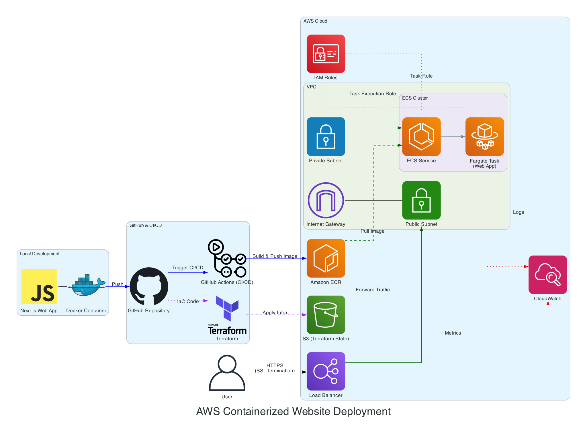

# AWS Deployment Demo

This project demonstrates how to deploy a containerized web application to AWS using Terraform. The application is a simple Todo app built with Next.js, Convex for the backend, Clerk for authentication, and styled with Tailwind CSS and shadcn/ui components.

## Architecture



The architecture diagram shows how the application is deployed to AWS using:
- ECR for container registry
- ECS for container orchestration
- Application Load Balancer for traffic distribution
- VPC with multiple availability zones for high availability
- CloudWatch for monitoring and logging
- IAM roles for security
- GitHub Actions for CI/CD pipeline

## Features

- User authentication with Clerk
- Real-time data synchronization with Convex
- Modern UI with Tailwind CSS and shadcn/ui
- Docker containerization
- AWS deployment with Terraform
- CI/CD with GitHub Actions

## Prerequisites

- Node.js 18+
- npm
- Docker
- AWS account
- Terraform

## Getting Started

1. Clone the repository:
   ```bash
   git clone https://github.com/yourusername/aws-presentation.git
   cd aws-presentation
   ```

2. Install dependencies:
   ```bash
   npm install
   ```

3. Set up environment variables:
   Create a `.env.local` file with the following:
   ```
   # Convex
   NEXT_PUBLIC_CONVEX_URL=your_convex_url

   # Clerk
   NEXT_PUBLIC_CLERK_PUBLISHABLE_KEY=your_clerk_publishable_key
   CLERK_SECRET_KEY=your_clerk_secret_key
   ```

## Presentation Components

This repository includes automation scripts to help you launch all the components needed for the AWS deployment presentation.

### Components

1. **AWS Demo App** (Port 3001):
   - Next.js application showcasing AWS deployment
   - Convex backend for real-time data

2. **Presentation Slides** (Port 3030):
   - Slidev presentation about AWS deployment
   - Content covers containerization, Terraform, and AWS services

### Starting the Presentation

#### Option 1: Using separate terminal windows (Recommended for macOS)

Run the following command:

```bash
./start_presentation_macos.py
```

This will:
- Open 3 separate Terminal windows
- Start the Next.js app in the first window
- Start the Convex backend in the second window
- Start the Slidev presentation in the third window
- Automatically open the slides in your browser

#### Option 2: Single process management

Run the following command:

```bash
./start_presentation.py
```

This will:
- Start all services as background processes
- Monitor all processes in a single terminal
- Provide a clean shutdown with Ctrl+C

### Accessing the Services

- **AWS Demo App**: http://localhost:3001
- **Slides**: http://localhost:3030
- **Slides Presenter Mode**: http://localhost:3030/presenter/

### Starting Services Manually

If you prefer to start services manually or if the automation scripts encounter issues:

```bash
# For the AWS Demo Next.js app
cd aws-demo && npm run dev

# For the AWS Demo Convex backend
cd aws-demo && npx convex dev

# For the slides
cd slides && npx slidev --open
```

## CI/CD Setup with GitHub Actions

This project includes a fully automated CI/CD pipeline using GitHub Actions that builds the Docker image, pushes it to ECR, and deploys the infrastructure with Terraform.

### Initial AWS Setup (One-time)

Before you can use the CI/CD pipeline, you need to set up a few AWS resources:

1. Create an S3 bucket for Terraform state:
   ```bash
   aws s3 mb s3://aws-demo-terraform-state --region us-east-1
   ```

2. Create an ECR repository:
   ```bash
   aws ecr create-repository --repository-name aws-demo-app --region us-east-1
   ```

3. Create SSM Parameters for secrets:
   ```bash
   aws ssm put-parameter --name /aws-demo/convex-url --value "your_convex_url" --type SecureString
   aws ssm put-parameter --name /aws-demo/clerk-publishable-key --value "your_clerk_publishable_key" --type SecureString
   aws ssm put-parameter --name /aws-demo/clerk-secret-key --value "your_clerk_secret_key" --type SecureString
   ```

### GitHub Secrets

Add the following secrets to your GitHub repository:

1. `AWS_ACCESS_KEY_ID`: Your AWS access key with permissions for ECR, S3, and ECS
2. `AWS_SECRET_ACCESS_KEY`: Your AWS secret key
3. `CONVEX_URL_PARAMETER_ARN`: The ARN of the SSM parameter for Convex URL
4. `CLERK_PUBLISHABLE_KEY_PARAMETER_ARN`: The ARN of the SSM parameter for Clerk publishable key
5. `CLERK_SECRET_KEY_PARAMETER_ARN`: The ARN of the SSM parameter for Clerk secret key

### Branch Strategy

- The `dev` branch is used for development and testing
- The `main` branch triggers the full CI/CD pipeline
- Pull requests to main will run tests but won't deploy until merged

### Pipeline Workflow

When code is pushed to the main branch, the CI/CD pipeline will:

1. Run tests and linting
2. Build the Docker image
3. Push the image to ECR
4. Run Terraform to provision or update the infrastructure
5. Deploy the application to ECS Fargate
6. Output the application URL

## AWS Costs and Management

It's important to understand the cost implications of the AWS services used in this project, especially if you plan to leave the infrastructure running for an extended period.

### AWS Services Used and Free Tier Eligibility

| Service | Free Tier | Notes |
| ------- | --------- | ----- |
| S3 | Yes | 5 GB Standard Storage, 20,000 GET, 2,000 PUT requests/month |
| ECR | Yes (12 months) | 500 MB/month storage for free |
| ECS Fargate | Yes (12 months) | 750 hours/month of usage (enough for 1 vCPU/0.5GB RAM container running 24/7) |
| ALB | **No** | Charged per hour + per GB data processed |
| VPC/Subnets | Yes | Free unless using NAT Gateway (not used in this demo) |
| CloudWatch | Yes | Basic monitoring free, 5GB/month logs free |
| IAM | Yes | Always free |
| SSM Parameter Store | Yes | 10,000 parameters at Standard tier free per month |
| Auto Scaling | Yes | Only pay for compute resources used |

### Cost Management Best Practices

1. **Always destroy infrastructure after demos**:
   ```bash
   cd terraform
   terraform destroy
   ```

2. **Set up AWS Billing Alerts**:
   - Navigate to AWS Billing Dashboard
   - Create a budget with notifications when reaching thresholds

3. **Monitor the Application Load Balancer (ALB)**:
   - This is the main source of costs that isn't covered by the free tier
   - Even a small demo with an ALB can cost a few dollars per month if left running

4. **Use smaller Fargate task sizes**:
   - The project defaults to 256 CPU units (0.25 vCPU) and 512 MB RAM
   - This is the smallest viable size for running a Next.js application

5. **Scale down when not in use**:
   - Set desired_count to 0 in the ECS service when not using the application
   - You can do this via the AWS Console or with this Terraform command:
     ```bash
     terraform apply -var="app_count=0"
     ```

### Estimated Costs

For demo purposes with minimal traffic:
- **S3, ECR, IAM, SSM, Auto Scaling**: Essentially free for typical demo usage
- **ECS Fargate**: Free within the free tier limits (12 months)
- **CloudWatch**: Free for basic usage
- **ALB**: $0.0225 per hour (~$16.50 per month) + data transfer charges

**IMPORTANT**: The ALB is the main cost driver. For cost-sensitive demos, consider destroying the infrastructure after each use or exploring alternative deployment options like AWS Elastic Beanstalk, Lightsail, or services like Vercel/Netlify for front-end applications.

## Deployment

### Manual Deployment (Alternative to CI/CD)

If you prefer to deploy manually, follow these steps:

#### Build and Push Docker Image

1. Build the Docker image:
   ```bash
   docker build -t aws-demo-app .
   ```

2. Tag and push to ECR:
   ```bash
   aws ecr get-login-password --region us-east-1 | docker login --username AWS --password-stdin YOUR_ACCOUNT_ID.dkr.ecr.us-east-1.amazonaws.com
   docker tag aws-demo-app:latest YOUR_ACCOUNT_ID.dkr.ecr.us-east-1.amazonaws.com/aws-demo-app:latest
   docker push YOUR_ACCOUNT_ID.dkr.ecr.us-east-1.amazonaws.com/aws-demo-app:latest
   ```

#### Deploy with Terraform

1. Navigate to the terraform directory:
   ```bash
   cd terraform
   ```

2. Initialize Terraform:
   ```bash
   terraform init -backend-config="bucket=aws-demo-terraform-state" -backend-config="key=terraform.tfstate" -backend-config="region=us-east-1"
   ```

3. Apply the configuration:
   ```bash
   terraform apply -var="aws_region=us-east-1" -var="app_image=YOUR_ACCOUNT_ID.dkr.ecr.us-east-1.amazonaws.com/aws-demo-app:latest"
   ```

4. After deployment, you can access the application via the ALB DNS name:
   ```bash
   terraform output alb_dns_name
   ```

## Stopping the Presentation Services

### For Option 1 (separate terminal windows):
- Simply close each Terminal window or press Ctrl+C in each window

### For Option 2 (single process):
- Press Ctrl+C in the terminal where you ran the script
- All child processes will be terminated automatically

## License

MIT
